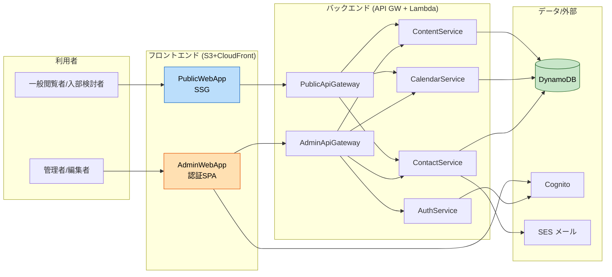

# コンポーネント依存関係 (Component Dependency) — IYフレンズ公式サイト

コンポーネント間の依存・通信パターン・データフローを示す。

---

## 依存関係マトリクス
「行 → 列」= 行が列に依存する（呼び出す/利用する）。

| ↓依存元 / 依存先→ | PublicApiGW | AdminApiGW | ContentSvc | CalendarSvc | ContactSvc | AuthSvc | DynamoDB | Cognito | SES |
|---|:--:|:--:|:--:|:--:|:--:|:--:|:--:|:--:|:--:|
| PublicWebApp | ● | | | | | | | | |
| AdminWebApp | | ● | | | | ●(login) | | ●(login) | |
| PublicApiGW | | | ● | ● | ●(送信) | | | | |
| AdminApiGW | | | ● | ● | ● | ●(認可) | | | |
| ContentService | | | | | | | ● | | |
| CalendarService | | | | | | | ● | | |
| ContactService | | | | | | | ● | | ● |
| AuthService | | | | | | | ●(任意) | ● | |
| BlogMigrationTool | | | ●(import) | | | | | | |
| InfrastructureStack | provisions すべての AWS リソース | | | | | | | | |

## 通信パターン
| 経路 | プロトコル | 認証 | 備考 |
|---|---|---|---|
| PublicWebApp → PublicApiGW | HTTPS/REST | なし | 読取＋問い合わせ送信。CloudFront経由でキャッシュ |
| AdminWebApp → AdminApiGW | HTTPS/REST | JWT(Cognito) | 全リクエストでトークン検証＋ロール認可 |
| AdminWebApp → Cognito | HTTPS | — | ログイン/MFA（Hosted UI/SDK） |
| ApiGW → Lambda(サービス) | AWS内部 | IAM | 最小権限 |
| ContactService → SES | AWS SDK | IAM | 通知メール送信 |
| AuthService → Cognito | AWS SDK | IAM | 招待/ユーザー管理 |
| サービス → DynamoDB | AWS SDK | IAM | 暗号化（保存/転送）（SECURITY-01） |

---

## データフロー図

### Mermaid Diagram



### Text Alternative（常時掲載）
```
[一般閲覧者/入部検討者] -> PublicWebApp(SSG) -> PublicApiGateway
    -> ContentService  -> DynamoDB
    -> CalendarService -> DynamoDB
    -> ContactService  -> DynamoDB, SES(メール通知)

[管理者/編集者] -> AdminWebApp(認証SPA)
    -> Cognito (ログイン/MFA)
    -> AdminApiGateway
        -> AuthService(認可) -> Cognito
        -> ContentService/CalendarService/ContactService -> DynamoDB (+監査ログ)

[BlogMigrationTool] -> (現行サイト収集) -> ContentService -> DynamoDB
InfrastructureStack(CDK) は上記すべての AWS リソースを構築
```

---

## 循環依存チェック
- サービス間の直接依存なし（各サービスは DynamoDB/外部連携のみに依存）。
- 認可は AuthService を共通前段に置くが、他サービスは AuthService を呼ばない（API Gateway/共通レイヤで前処理）。→ **循環依存なし**。

## 段階リリースとの対応
- **Phase 1**: PublicWebApp + PublicApiGateway + ContentService(読取) + CalendarService(読取) + ContactService(送信/通知) + BlogMigrationTool + InfrastructureStack(公開分)
- **Phase 2**: AdminWebApp + AdminApiGateway + AuthService + 各サービスの管理API + Cognito
