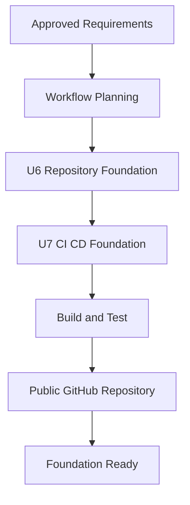

# Development Environment Execution Plan

## Detailed Analysis Summary

- **Transformation type**: Workspace-wide development tooling and deployment automation
- **Primary changes**: Root Git repository, public GitHub monorepo, CI/CD, repository Skill, Codex Hooks, Git hooks, AWS OIDC bootstrap
- **Affected components**: Workspace root, both frontend projects, backend API, shared infrastructure, AI-DLC documentation
- **User-facing changes**: None
- **Data model changes**: None
- **API changes**: None
- **Infrastructure changes**: GitHub OIDC Provider and deployment roles in AWS
- **Risk level**: Medium
- **Rollback complexity**: Moderate. Local files are Git-managed; GitHub repository and AWS IAM bootstrap require explicit teardown if rolled back.
- **Testing complexity**: Moderate. Local policy tests, component builds/tests, SAM lint, workflow syntax, GitHub CI, and OIDC trust verification are required.

## Current Findings That Shape the Plan

- Git 2.54 is installed and global username/email are configured.
- GitHub CLI is not installed; `winget` is available.
- Python is not currently available from `python` or `py`.
- Node.js, npm, Docker CLI, AWS CLI, and SAM CLI are installed.
- No GitHub OIDC Provider exists in the AWS account.
- The existing backend workflow is nested under `iyf-backend-api/.github` and will not run as a root GitHub workflow.
- No private keys, AWS Access Key IDs, or GitHub token formats were found in the initial scan.
- Local `.env` files and `.claude/settings.local.json` exist and must remain untracked.
- `aidlc-docs/audit.md` contains an AWS account ID and raw operational history; it will remain local and untracked in the public repository.

## Component Relationships

- **Repository policy tools** are consumed by Git pre-commit hooks, Codex Hooks, and CI.
- **Repository Skill** documents non-obvious project topology and delegates deterministic checks to repository scripts.
- **CI** validates all four projects but never deploys the admin web.
- **CD** depends on the GitHub repository, GitHub `production` Environment, AWS OIDC Provider, and deployment roles.
- **AWS bootstrap stack** owns GitHub federation only and remains separate from the application stacks.

## Module Update Strategy

1. **Public-readiness policy** — determine exactly which files may enter a public repository.
2. **Root repository foundation** — establish ignore, attributes, documentation, and Git root.
3. **Reusable policy tools** — create cross-platform checks used by Hooks and CI.
4. **Repository Skill and Hooks** — add Codex guidance and local guardrails.
5. **CI workflows** — validate all components from the monorepo root.
6. **OIDC bootstrap IaC** — define narrowly trusted GitHub federation and deployment roles.
7. **Manual CD workflow** — add target selection, approval environment, ordering, and concurrency.
8. **GitHub publication** — create the public repository only after the staged-file audit passes.
9. **Remote verification** — observe CI and verify OIDC assumption without running an application deployment.

## Workflow Visualization

Text alternative: Approved requirements proceed to workflow planning, repository foundation, CI/CD foundation, build and test, public GitHub publication, and completion.

## Phases to Execute

### Inception

- [x] Requirements Analysis — completed and approved
- [x] User Stories — skipped; this is internal developer tooling with no new user journey
- [x] Workflow Planning — completed; awaiting approval
- [x] Application Design — skipped; no new application service or business component
- [x] Units Generation — execute as two implementation units defined below

### Construction

- [x] U6 Repository Foundation — functional design and code generation
- [ ] U7 CI/CD Foundation — infrastructure design and code generation
- [ ] Build and Test — local validation, staged-file audit, GitHub CI, and OIDC verification

## Unit U6: Repository Foundation

### Planned Outputs

- Root `.gitignore`, `.gitattributes`, and `.editorconfig`
- Root developer documentation and Codex `AGENTS.md`
- Cross-platform repository policy/check scripts and focused tests
- `.githooks/pre-commit` plus an installation command
- `.codex/hooks.json` and repository Hook scripts
- `.agents/skills/iyf-development/SKILL.md` with minimal supporting references
- Root Git repository with `main` as the initial branch

### Detailed Steps

- [x] Classify every public-readiness match without printing secret values.
- [x] Exclude `.env`, local settings, audit history, caches, dependencies, build outputs, SAM outputs, and credentials.
- [x] Add a deterministic staged-file policy checker for secrets, forbidden paths, conflict markers, and oversized files.
- [x] Add tests for allowed and denied policy-check cases.
- [x] Add a fast Git pre-commit hook that runs the staged-file checker.
- [x] Add a Codex `SessionStart` hook that supplies project-specific context.
- [x] Add a Codex `PreToolUse` hook that guards destructive Git/AWS operations and protected local files.
- [x] Create the repository Skill using the official repository skill location and validate it with the Skill Creator validator.
- [x] Initialize Git at the workspace root and configure the repository hook path.
- [x] Inspect the complete staged file list before the initial commit.

## Unit U7: CI/CD Foundation

### Planned Outputs

- Root `.github/workflows/ci.yml`
- Root `.github/workflows/deploy-production.yml`
- AWS OIDC bootstrap SAM/CloudFormation template
- Deployment helper scripts with explicit target selection
- GitHub `production` Environment configuration instructions
- Public GitHub repository named `iy-friends`, unless the authenticated owner requires a collision-safe name

### Detailed Steps

- [x] Install Python 3.13 and GitHub CLI after command-level approval.
- [x] Create root CI jobs for repository policy, public web, admin web, backend, SAM lint, dependency scanning, and SBOM generation.
- [x] Use lock files and pinned versions; pin third-party Actions to immutable commit SHAs where practical.
- [x] Remove the ineffective nested backend workflow after equivalent root coverage exists.
- [x] Create a separate AWS bootstrap template for the GitHub OIDC Provider, GitHub deployment role, and CloudFormation execution role.
- [x] Restrict OIDC trust to the exact GitHub owner/repository and `production` Environment subject.
- [x] Limit workflow permissions to `contents: read` and deploy-job `id-token: write`.
- [x] Add `workflow_dispatch` target selection for `infra`, `backend`, `public-web`, and `all`.
- [x] Exclude admin web deployment in every target path.
- [x] Add a production concurrency group and fail-fast dependency ordering.
- [x] Create/authenticate the GitHub repository only after the public-readiness check passes.
- [x] Configure the GitHub `production` Environment and deployment branch restriction.
- [ ] Deploy the OIDC bootstrap stack locally through the existing AWS SSO administrator session.
- [ ] Push the initial commit and inspect the first CI result.
- [ ] Verify OIDC role assumption from GitHub without deploying application resources.

## Build and Test Plan

- [x] Run repository policy unit tests.
- [x] Exercise Git pre-commit with allowed and intentionally denied temporary fixtures.
- [x] Exercise Codex Hook scripts with representative JSON inputs without invoking real destructive commands.
- [x] Validate `hooks.json` as JSON and against documented event/output shapes.
- [x] Validate the repository Skill with `quick_validate.py`.
- [x] Run `npm ci`, typecheck, and build for both frontend projects.
- [x] Install backend development dependencies and run pytest including Hypothesis PBT.
- [x] Run `sam validate --lint` for backend, shared infra, and OIDC bootstrap templates.
- [x] Run npm and Python dependency vulnerability scans.
- [x] Generate an SBOM without retaining it as a long-lived public artifact unless needed.
- [x] Parse GitHub workflow YAML and review effective workflow permissions.
- [x] Confirm the initial Git staged set contains no ignored or sensitive files.
- [ ] Confirm the first GitHub CI run succeeds.
- [ ] Confirm GitHub OIDC can assume only the intended AWS role from the production environment.

## Security Compliance

- **SECURITY-01**: N/A for workflow planning; no new data store is introduced.
- **SECURITY-02**: N/A for the development foundation; existing CloudFront logging remains a separate application hardening item.
- **SECURITY-03**: Compliant in plan; Hooks and CI avoid sensitive output and return structured, minimal diagnostics.
- **SECURITY-04**: N/A; no HTML-serving behavior changes.
- **SECURITY-05**: Compliant in plan; Hook and workflow inputs are validated against allowlists.
- **SECURITY-06**: Compliant in plan; OIDC trust and AWS roles are scoped, with a separate CloudFormation execution role.
- **SECURITY-07**: N/A; no network topology changes.
- **SECURITY-08**: N/A; application authorization is unchanged.
- **SECURITY-09**: Compliant in plan; local credentials and generated files are excluded from the public repository.
- **SECURITY-10**: Compliant in plan; lock files, dependency audits, SBOM, and immutable Action references are required.
- **SECURITY-11**: Compliant in plan; GitHub approval, OIDC trust, IAM policy, Hooks, and pre-commit checks provide layered controls.
- **SECURITY-12**: Compliant in plan; no long-lived AWS credentials are stored in GitHub.
- **SECURITY-13**: Compliant in plan; deployment approval and immutable Action references protect pipeline integrity.
- **SECURITY-14**: N/A for the pipeline foundation; GitHub run history supplies pipeline auditability, while application alerting remains separate.
- **SECURITY-15**: Compliant in plan; failed validation or deployment stops dependent steps and does not fail open.

No blocking Security Baseline finding exists in this execution plan.

## PBT Compliance

- Partial enforcement applies to pure functions and serialization boundaries.
- Existing Hypothesis PBT remains included in CI.
- New repository policy parsing is a pure function candidate; invariant and reproducibility tests will be added where they provide meaningful coverage.
- PBT rules unrelated to pure parsing or serialization are N/A for this change.

## Explicit Boundaries

- The plan does not deploy or host the admin web.
- The plan does not trigger an application production deployment during setup verification.
- The plan does not delete existing AWS resources.
- Public GitHub publication happens only after staged-file and sensitive-information review succeeds.
- Any system package installation, AWS bootstrap deployment, public GitHub repository creation, or push uses the normal command approval boundary.
