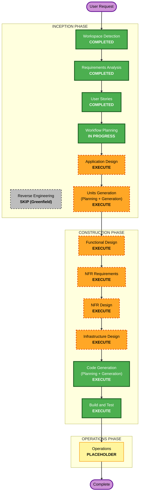

# 実行計画 (Execution Plan) — IYフレンズ公式サイト

## Detailed Analysis Summary

### Transformation Scope
- **Project Type**: Greenfield（新規構築。既存サイトはノーコードサービス上のため、実質新規開発）
- **Transformation Type**: Full application build（フロント＋バックエンド＋インフラ＋CMS＋認証）
- **Primary Changes**: React(TS) 公開サイト、Python サーバーレスAPI、AWS インフラ、Cognito 認証、DynamoDB データ層
- **Related Components**: フロントSPA / API(Lambda) / データ(DynamoDB) / 認証(Cognito) / メール(SES) / 配信(S3+CloudFront) / IaC(CDK等)

### Change Impact Assessment
- **User-facing changes**: Yes — 公開サイト全面刷新（apple-design）＋管理CMS（スマホ最適化）
- **Structural changes**: Yes — サーバーレス新規アーキテクチャ
- **Data model changes**: Yes — ブログ/お知らせ/カレンダー/問い合わせ/ユーザーのスキーマ新設
- **API changes**: Yes — 公開API（閲覧）＋管理API（投稿・認証必須）を新設
- **NFR impact**: Yes — セキュリティ（ブロッキング）、低コスト、パフォーマンス、レスポンシブ、PII最小化

### Risk Assessment
- **Risk Level**: Medium（小規模だが本番・未成年PII・認証あり。新規のためロールバックは容易）
- **Rollback Complexity**: Easy（新規サイト。段階リリースで公開範囲を制御可能）
- **Testing Complexity**: Moderate（認証・投稿・移行データ・PBT部分適用）

---

## Workflow Visualization

### Mermaid Diagram



### Text Alternative（常時掲載）
```
INCEPTION PHASE
- Workspace Detection ........ COMPLETED
- Reverse Engineering ........ SKIP (Greenfield)
- Requirements Analysis ...... COMPLETED
- User Stories ............... COMPLETED
- Workflow Planning .......... IN PROGRESS
- Application Design ......... EXECUTE
- Units Generation ........... EXECUTE

CONSTRUCTION PHASE (per unit)
- Functional Design .......... EXECUTE
- NFR Requirements ........... EXECUTE
- NFR Design ................. EXECUTE
- Infrastructure Design ...... EXECUTE
- Code Generation ............ EXECUTE (always)
- Build and Test ............. EXECUTE (always)

OPERATIONS PHASE
- Operations ................. PLACEHOLDER
```

---

## Phases to Execute

### 🔵 INCEPTION PHASE
- [x] Workspace Detection (COMPLETED)
- [x] Reverse Engineering (SKIPPED — Greenfield)
- [x] Requirements Analysis (COMPLETED)
- [x] User Stories (COMPLETED)
- [x] Execution Plan (IN PROGRESS)
- [ ] Application Design — **EXECUTE**
  - **Rationale**: フロント・バックエンド・認証・CMS の新規コンポーネント／サービスとメソッド・業務ルール（公開/下書き、招待、PII最小化）を定義する必要がある
- [ ] Units Generation — **EXECUTE**
  - **Rationale**: システムを複数ユニット（公開フロント／管理CMS／バックエンドAPI／認証／データ／インフラ）へ分解する必要がある。2段階リリースの単位化にも直結

### 🟢 CONSTRUCTION PHASE（各ユニットごとに実施）
- [ ] Functional Design — **EXECUTE**
  - **Rationale**: 新規データモデル（ブログ/お知らせ/カレンダー/問い合わせ/ユーザー）と業務ロジックの詳細設計が必要
- [ ] NFR Requirements — **EXECUTE**
  - **Rationale**: セキュリティ（ブロッキング有効）、低コスト、パフォーマンス、レスポンシブ等の NFR とスタック確定
- [ ] NFR Design — **EXECUTE**
  - **Rationale**: NFR Requirements を受けた設計パターン（暗号化・認可・ヘッダ・監視・レート制限等）の反映
- [ ] Infrastructure Design — **EXECUTE**
  - **Rationale**: AWS サーバーレス構成（S3/CloudFront/API GW/Lambda/DynamoDB/Cognito/SES）のマッピングが必要
- [ ] Code Generation — **EXECUTE (ALWAYS)**
  - **Rationale**: 実装計画とコード生成
- [ ] Build and Test — **EXECUTE (ALWAYS)**
  - **Rationale**: ビルド・単体/結合テスト・PBT（部分適用）・検証

### 🟡 OPERATIONS PHASE
- [ ] Operations — PLACEHOLDER
  - **Rationale**: 将来のデプロイ・監視ワークフロー用（現状は Construction の Build and Test で対応）

## スキップするステージ
- **Reverse Engineering** — Greenfield のため不要（既存コードなし）

## Estimated Timeline
- **Total Phases**: INCEPTION 残り2ステージ（Application Design, Units Generation）＋ CONSTRUCTION（ユニット×6段階）＋ Build and Test
- **Estimated Duration**: 反復的に進行（各ステージで承認ゲートあり）。2段階リリース方針により Phase 1（公開サイト）を先行して形にできる

## Success Criteria
- **Primary Goal**: 既存サイトを AWS 上で本番品質にリニューアル（公開サイト＋管理CMS）
- **Key Deliverables**: React(TS) 公開SPA、Python サーバーレスAPI、AWS IaC、Cognito 認証、ブログ移行データ表示
- **Quality Gates**: Security Baseline（ブロッキング）全適合、PBT 部分適用、レスポンシブ/apple-design、低コスト運用
